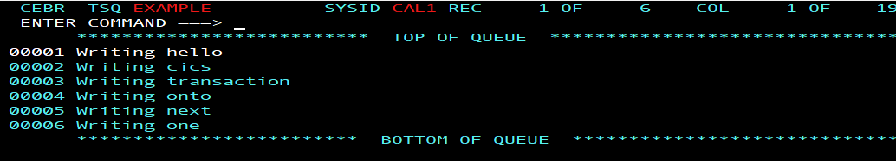
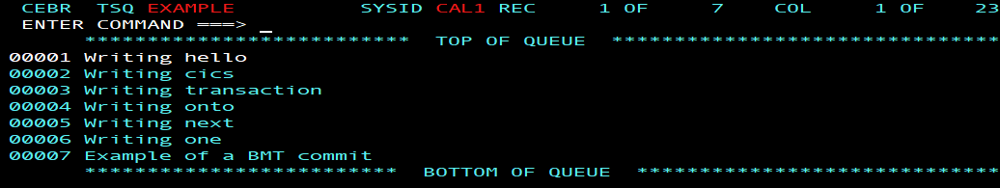
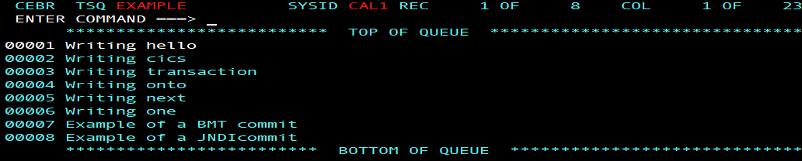
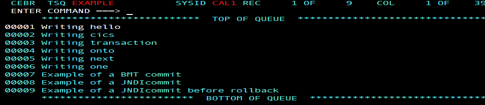

# Spring Boot Java applications for CICS - Part 3 - Transactions

## Introduction

This article demonstrates a transactional Spring Boot application for use in CICS Liberty. We'll cover Spring Boot's approach to container managed transactions, using the @Transactional annotation, as well the Spring TransactionTemplate interface for a Bean Managed Transaction. These approaches are then contrasted with the Java EE approach of using the JTA UserTransaction interface to create a bean managed transaction.


Transaction management can be used to coordinate updates across multiple XA resource managers. In our scenarios, the Liberty transaction manager is the coordinator and the CICS unit of work is subordinate to this (as though the transaction had originated outside of the CICS system). CICS recoverable resources include TSQs, VSAM files, and JDBC type 2 connections to Db2, while recoverable resources used by CICS but not managed by CICS include JDBC type 4 connections and JMS connection factories.


### Learning objectives

In this tutorial we will use a recoverable TSQ to demonstrate the principles of transaction coordination, we'll learn different ways of transactionally managing Spring Boot applications in a CICS Liberty JVM server, and how to build the Spring Boot application with the Gradle or Maven build tools.


The following steps give an overview of the objectives:

1: Create a basic Spring Boot web application

2: Build and deploy the Spring Boot application with Gradle or Maven

3: Create a CICS TS Model to designate a TSQ as recoverable. A recoverable TSQ is a simple construct to demonstrate the effects of transaction commit and rollback.

4: Use Spring Boot's @Transactonal annotation at the class or method level. This approach automatically integrates Spring Boot's transactional capability with the Liberty transaction manager and is similar in concept to EJBs Container Managed Transactions (CMT).

5: Use Spring's TransactionTemplate interface, this also gives automatic integration with the Liberty transaction manager, but is more similar to EJBs Bean Managed Transactions (BMT).

6: Finally from within the Spring Boot application we will use the more Java EE centric approach of creating *User Transactions* directly from the Liberty transaction manager. This is also a Bean Managed Transaction (BMT) approach. 

All the techniques discussed integrate Spring Boot with Liberty's transaction manager. If you are running in CICS Liberty then the CICS UOW is also automatically integrated with Liberty's transaction manager becoming subordinate to Liberty's global (XA) transaction. The net result is that your Java work and CICS work can be committed or rolled back as one.

The application source and build scripts are available in the cicsdev/cics-java-liberty-springboot-transactions repository.


### Prerequisites

* CICS TS V5.3 or later
* A configured Liberty JVM server in CICS
* Java SE 1.8 on the z/OS system
* Java SE 1.8 on the workstation
* An Eclipse development environment on the workstation
* Either Gradle or Apache Maven on the workstation (Buildship or M2Eclipse)


### Estimated time

It should take you about 1 hour to complete this tutorial.


## Step 1: Create the Application


You can develop the code by following this tutorial step-by-step, or by downloading or cloning the [cics-java-liberty-springboot-transactions](https://github.com/cicsdev/cics-java-liberty-springboot-transactions) example in GitHub.


If you are following step-by-step, generate and download a Spring Boot web application using the Spring initializr website tool. For further details on how to do this, and how to deploy bundles to CICS, see this tutorial - [spring-boot-java-applications-for-cics-part-1-jcics-maven-gradle](https://developer.ibm.com/technologies/java/tutorials/spring-boot-java-applications-for-cics-part-1-jcics-maven-gradle). We use Eclipse as our preferred IDE.

Once your newly generated project has been imported into your IDE, you should have the Application.java and ServletInitializer.java classes which provide the basic framework of a Spring Boot web application. Add the TransactionController.java class snippet as seen below. This class is used as the central coordinator for all the REST requests from your browser. Later we will adapt and extend it to drive the different transactional approaches, but for now it's just a simple text response to the root REST request.


```java

package com.ibm.cicsdev.springboot.transactions;

@RestController
public class TransactionController 
{   
    @GetMapping("/")
    public String index() 
    {
        return "Greetings from com.ibm.cicsdev.springboot.transaction servlet";       
    }
}
```

If you are following step-by-step you can run this locally as a Java Application, point your browser to `http://localhost:8080/` to test the basic function.

## Step 2: Building and deploying a Spring Boot web application with Gradle or Maven

In the first part of this tutorial series we looked in-depth at how to use Gradle or Maven to build a Spring Boot web application. [Spring Boot Java applications for CICS, Part 1: JCICS, Gradle, and Maven](https://developer.ibm.com/tutorials/spring-boot-java-applications-for-cics-part-1-jcics-maven-gradle/)

Using that knowledge you should now be in a position to enhance the *build.gradle*, or *pom.xml* to include the necessary dependencies to compile against a variety of Transaction APIs. In particular we require the Java Transaction API (JTA) and Spring's Transactional API (which includes the Transaction Templates and @Transaction annotation support).

For Gradle, your build file should have the following dependencies.

    '''Gradle
	dependencies
	{
      implementation ("org.springframework.boot:spring-boot-starter-web")
    
      // For JTA Bean managed transactions (this is newer and covers up to jta-1.3)
      implementation ("javax.transaction:javax.transaction-api")
    
      // For the @Transactional annotation
      implementation ("org.springframework:spring-tx")
    
      // Don't include TomCat in the runtime build
      providedRuntime("org.springframework.boot:spring-boot-starter-tomcat")
    
      // CICS BOM (as of May 2020)
      compileOnly enforcedPlatform('com.ibm.cics:com.ibm.cics.ts.bom:5.5-20200519131930-PH25409')
    
      // Don't include JCICS in the final build (no need for version because we have BOM)
      compileOnly("com.ibm.cics:com.ibm.cics.server")              
    }
	'''

For Maven, you'll need the following dependencies in your pom.xml

    '''XML
    <!-- CICS BOM (as of May 2020) -->
    <dependencyManagement>
      <dependencies>
        <dependency>
          <groupId>com.ibm.cics</groupId>
          <artifactId>com.ibm.cics.ts.bom</artifactId>
          <version>5.5-20200519131930-PH25409</version>
          <type>pom</type>
          <scope>import</scope>
        </dependency>
      </dependencies>
    </dependencyManagement>
  
    <dependencies>      
      <!-- Compile against, but don't include JCICS in the final build (version and scope are from BOM) -->
      <dependency>
        <groupId>com.ibm.cics</groupId>
        <artifactId>com.ibm.cics.server</artifactId>
      </dependency>
    
      <!-- Spring-transactions -->
      <dependency>
        <groupId>org.springframework</groupId>
        <artifactId>spring-tx</artifactId>
      </dependency>
    
      <!-- Spring Boot web support -->
      <dependency>
        <groupId>org.springframework.boot</groupId>
        <artifactId>spring-boot-starter-web</artifactId>
      </dependency>
				
      <!-- javax.transaction API -->
      <dependency>
        <groupId>javax.transaction</groupId>
        <artifactId>javax.transaction-api</artifactId>
      </dependency>
    
      <!-- Compile against, but don't include TomCat in the runtime build -->
      <dependency>
        <groupId>org.springframework.boot</groupId>
        <artifactId>spring-boot-starter-tomcat</artifactId>
        <scope>provided</scope>
      </dependency>
    
    </dependencies>
	'''


Running the build tool of choice should produce a WAR file ready to deploy. When the time comes (see later), you can deploy it in a CICS bundle, or directly as an WAR <application> element in the Liberty server.xml.


## Step 3: Create a TSMODEL

Our next step is to interact with a CICS recoverable resource. We chose a recoverable TSQ for simplicity, the contents of the TSQ can provide a clear indication of the commit/rollback effects.

For transactional recovery to work with TSQs you need to make the TSQ recoverable. To do this define a CICS TSMODEL resource with the *Prefix* attribute set to the name of the TSQ, and a *Recovery* attribute set to Yes. Our TSQ is called "EXAMPLE", don't install the TSMODEL yet - you'll get a better indicator of the transactional intent if we save that for later. 


For example:


## Step 4 : Spring Boot @Transactional


So let's update our code to demonstrate Spring Boot's approach to container managed transactions. The @Transactional annotation can be used at the class or method level. For more information on CICS UOW in Liberty see [Using Java Transactions in CICS Liberty to coordinate JDBC updates](https://developer.ibm.com/cics/2017/02/01/using-java-transactions-in-cics-liberty-to-coordinate-jdbc-updates/)


The advantage of the @Transactional annotation over Bean Managed Transactions is that you do not explicitly have to code begin() and commit() to demark the transaction. Instead you call a class or method that has the @Transactional annotation on it. Spring Boot, by virtue of integration with Liberty's transaction manager, then co-ordinates the transaction with both Liberty and the CICS UOW.

So let us create our new class to demonstrate Spring Container Managed Transactions - SpringTransactional.java

In this example we write text to the CICS TSQ and then either commit or rollback the transaction. If the text contains the word 'rollback' we throw an Unchecked Exception to force rollback, otherwise the transaction is committed.

Note that by default Spring Framework's transaction infrastructure only marks a transaction for rollback if it detects an unchecked exception. JCICS exceptions, such as a CICSConditionException are checked, but we can force a rollback for all exceptions using @Transactional(rollbackFor=Exception.class).


Cut and Paste code -

	```java
    package com.ibm.cicsdev.springboot.transactions;
    
    import org.springframework.stereotype.Component;
    import org.springframework.transaction.annotation.Transactional;
    import com.ibm.cics.server.CicsConditionException;
    import com.ibm.cics.server.TSQ;
    
    /**
     * This component uses @Transactional to manage transactions in
     * a container oriented manner.
     */
    @Component
    public class SpringTransactional 
    {
       /**
        * Write an input string to a CICS TSQ using the @Transactional annotation. 
        * If the input text contains 'rollback' then generate a RuntimeException
        * which triggers rollback.
        * 
        * @param text
        * @return status message
        * @throws CicsConditionException 
        */
        @Transactional (rollbackFor=Exception.class)
        public String writeTSQ(String text) throws CicsConditionException 
        {
            // Create JCICS representation of TSQ object
            TSQ tsq = new TSQ();
            tsq.setName(Application.TSQNAME);
    
            // Write it to the TSQ
            tsq.writeString(text);
    
            // If the string contains 'rollback' then throw an exception to trigger rollback
            if (text.contains("rollback")) 
            {
                throw new RuntimeException("SpringTransactional.writeTSQ(): Rollback request was detected"); 
            }	
    
            return text;
        }
    }
    ```

To use this we need to update our TransactionController.java class with a new method and 'autowire' in an instance of the above ContainerTransactions class.

	```java
	@Autowired ContainerTransactions transactional; 
	
	/**
	 * Transactional web request
	 * @return message
	 * @throws CicsConditionException 
	 */
	@GetMapping("/transactional")
	public String transactionalrollback() throws CicsConditionException {
		
		//This should work and commit as error is not in data sent in this transaction
		try {
		transactional.exampleTransactional("hello","cics","transaction");
		}
		catch(Exception e){
			System.out.println("Failed to write data to TSQ");
		}
		
		//This should error and rollback as error in data sent in this transaction.  
		//The @Tranascational method will rollback automatically on error.
		try {
		transactional.exampleTransactional("goodbye","error","fred");
		}
		catch(Exception e){
			System.out.println("Failed to write data to TSQ");
		}
		
		//This should work and commit as error is not in data sent in this transaction
		try {
		transactional.exampleTransactional("onto","next","one");
		}
		catch(Exception e){
			System.out.println("Failed to write data to TSQ");
		}
		return "Greetings from com.ibm.cicsdev.springboot.transaction transactional";
	}
	```


If we now run the servlet from the uri /transactional url you should see the web browser return "Greetings from com.ibm.cicsdev.springboot.transaction transactional"

And if you browse the CICS TSQ using CEBR EXAMPLE you should see the following entries.
You should see that two of the transactions completed, the first and last. But the middle one was rolled back as it has "error" in the text strings passed in.




## Step 5 : Springs Transaction Template for Bean Managed Transactions


We will now update our code to use Spring's TransactionTemplate interface for a Bean Managed Transaction.  This will use Spring Boots programatic way of managing the transactions.

To do this we add the Spring frameworks transaction manager to our code.


```java

    private PlatformTransactionManager transactionManager;
	
	private TransactionTemplate tranTemplate;	
...
        tranTemplate = new TransactionTemplate(transactionManager);
        tranTemplate.setPropagationBehavior(TransactionTemplate.PROPAGATION_REQUIRED);
        tranTemplate.execute(new TransactionCallbackWithoutResult() {
...
```

which allows us to programatically rollback via

```java
status.setRollbackOnly();
```

For more information on this see:
[Spring Information on programmatic transaction management](https://docs.spring.io/spring/docs/3.0.0.M3/reference/html/ch11s06.html)


To do this we will create a new class called BeanTransactionsns

Cut and Paste Code

	```java
	@Component
	public class BeanTransactions 
	{	
	
	@Autowired
    private PlatformTransactionManager transactionManager;
	
	private TransactionTemplate tranTemplate;		   
    
    /**
     * @param str
     */
    public void exampleBeanManangedTransaction(String str) 
    {    	
    	tranTemplate = new TransactionTemplate(transactionManager);
        tranTemplate.setPropagationBehavior(TransactionTemplate.PROPAGATION_REQUIRED);
    	
        // Execute the transactional method to do the CICS update
    	tranTemplate.execute(new TransactionCallbackWithoutResult() 
    	{    		
    	    protected void doInTransactionWithoutResult(TransactionStatus status) 
    	    {    	    	
    	    	if (status.isNewTransaction()) 
    	    	{
    	    		System.out.println("exampleBMTCommit: Starting new JTA transaction ");    	    		
    	    	}  	    	
    	    
    			
    			// Force a rollback if the input matches a specific string 
    			if (str.equalsIgnoreCase("rollback")) {
    				status.setRollbackOnly();    				
    			}
    			
    			//Initilaise TSQ
    			TSQ targetQueue = new TSQ();
    			targetQueue.setName("EXAMPLE");
    			
    			// Write a string to the TSQ 
    			try 
    			{    				
					targetQueue.writeString("Example of a BMT commit");					
					
				// If JCICS command fails then force a rollback of the JTA transaction and the CICS UOW	
				} 
				catch (CicsConditionException e) 
				{
					
					System.out.println("exampleBMTCommit: CicsConditionException, forcing rollback");
					status.setRollbackOnly();
					e.printStackTrace();
				} 
				  	        
    	    }
    	});
    } 
	```

To use this bean, we need to add some more code to our TransactionController, to autowire in the BeanTransaction. We will add two methods, which call our bean. One which will force a rollback, and the other a commit. We will call them from two different URL's for convienice.


Cut and Paste Code

	```java
	@Autowired BeanTransactions beanTran;
	
	/**
	 * Bean transaction rollback web request
	 * @return message
	 */
	@GetMapping("/BMTrollback")
	public String rollbackBMT() {

		beanTran.exampleBeanManangedTransaction("rollback");;
		return "Greetings from com.ibm.cicsdev.springboot.transaction servlet rollback";
	}
	
	/**
	 * Bean transaction commit web request
	 * @return message
	 */
	@GetMapping("/BMTcommit")
	public String commitBMT() {

		beanTran.exampleBeanManangedTransaction("commit");;
		return "Greetings from com.ibm.cicsdev.springboot.transaction servlet commit";
	}
	```


When we build this and and replace the war file in our CICS bundle project. With the updated project uploaded, we can disable and re-enable the CICS bundle to deploy the application, and then use the browser with path /BMTrollback to run the rollback demonstration.


This will rollback the transaction as rollback is in the string passed to the bean. If we browse the TSQ again we will see no message added to it.


Eg


If we then run the /BMTcommit version, the transaction will be commited and we can see this adding to the TSQ as shown below, with the message "Example of a BMT commit".



##Step 6 : JNDI lookup approach to Bean Managed Transactions


Finally we will take a look at a JNDI way of using Bean Managed Transactions, which will be more familiar to those used to Java EE.

###JTA in a CICS Liberty JVM server

In CICS, transaction management does not need to be explicitly started as there is an implicit UOW for every task, however JTA will either require a Container Managed Transaction (CMT) annotation on a class or method, or a UserTransaction coded with a begin() method. It should be noted whilst using JTA you cannot use the JCICS methods Task.commit() or Task.rollback() as the CICS recovery manager is subordinate to the Liberty transaction manager. Instead the transaction completes when the application reaches either a UserTransaction commit() or rollback() method, or by the Liberty web container when the web application terminates.


Further information on Java Transaction API (JTA) within a CICS Liberty JVM server can be found in topic Java Transaction API (JTA), which has an example of using it with a Db2 type 2 database.


More in depth information for this with JEE can be found in the following CICSDev artcile
[Using Java Transactions in CICS Liberty to coordinate JDBC updates](https://developer.ibm.com/cics/2017/02/01/using-java-transactions-in-cics-liberty-to-coordinate-jdbc-updates/)


We will create a new class for clarity - JNDIBeanManagedTransactions


Cut and Paste Code

```java
@Component
public class JNDIBeanManagedTransactions {
	/**
	 * JNDI Commit
	 */
	public void exampleJNDICommit() {

		UserTransaction tran = lookupContext();

		// Commit a message to the TSQ
		try {
			// Set up our TSQ to be ready to write
			TSQ targetQueue = new TSQ();
			targetQueue.setName("EXAMPLE");

			// Start our user transaction
			tran.begin();

			// Write a simple phrase to the queue and then commit
			targetQueue.writeString("Example of a JNDIcommit");

			tran.commit();

		} catch (Exception e) {
			System.out.println("exampleJNDICommit: exception");
			e.printStackTrace();
		}
	}
	
	/**
	 * JNDI Commit and Rollback
	 */
	public void exampleJNDICommitAndRollback() {

		UserTransaction tran = lookupContext();

		// Commit a message to the TSQ
		try {
			// Set up our TSQ to be ready to write
			TSQ targetQueue = new TSQ();
			targetQueue.setName("EXAMPLE");

			// Start our user transaction
			tran.begin();

			// Write a simple phrase to the queue and then commit
			targetQueue.writeString("Example of a JNDIcommit before rollback");

			tran.commit();
			
			// Start another user transaction that will be rolled back		
			tran.begin();

			targetQueue.writeString("This will be rolled back");

			tran.rollback();

		} catch (Exception e) {
			System.out.println("exampleJNDICommit: exception");
			e.printStackTrace();
		}
	}
	
	private UserTransaction lookupContext() {

		// Find the Java EE (Liberty) JNDI transaction manager
		InitialContext ctx;
		UserTransaction tran = null;
		try {
			ctx = new InitialContext();
			tran = (UserTransaction) ctx.lookup("java:comp/UserTransaction");

		} catch (NamingException e1) {
			e1.printStackTrace();
			System.out.println("exampleJNDICommit: JTA JNDI lookup failed");
		}

		return tran;
	}
}
```


To use this we need to autowire this into our TransactionController.


Cut and Paste Code

```java
	@Autowired JNDIBeanManagedTransactions jndiTran;
	
	/**
	 * JNDI Commit Web request
	 * @return message
	 */
	@GetMapping("/JNDIcommit")
	public String jndiCommit() {

		jndiTran.exampleJNDICommit();
		return "Greetings from com.ibm.cicsdev.springboot.transaction servlet jndiCommit";
	}
	
	/**
	 * JNDI Commit and Rollback Web request
	 * @return message
	 */
	@GetMapping("/JNDIcommitAndRollback")
	public String jndiCommitAndRollback() {

		jndiTran.exampleJNDICommitAndRollback();
		return "Greetings from com.ibm.cicsdev.springboot.transaction servlet jndiCommitAndRollback";
	}
```


Running the JNDIcommit URL will just write a message "Example of a JNDIcommit" to the Example TSQ.


Eg




The other URL will commit the first message "Example of a JNDIcommit before rollback" to the TSQ, but rollback the second message "This will be rolled back", so only the former message will be seen when browsing the TSQ.


Eg




The JTA rollback() method is typically only used when handling errors, and ensures that data updated within the current transaction is rolled back.

## Running the samples


TODO: run without TSMODEL, then again with TSMODEL


### Liberty configuration

If you don't yet have a Liberty JVM server configured, using CICS auto-configuration is a great way to start. If you enable auto-configuration in the JVM profile, it will generate a basic server.xml when the JVM server is enabled. For more information, see Configuring a Liberty JVM server in the CICS Knowledge Center.

If you're customising an existing configuration, you'll need to make sure you include the following feature:
jsp-2.3. Also the httpPort should be configured to a port available on your system. By default it uses 9080 - ensure you choose a unique value.

With the JVM server and the application successfully deployed. In your Liberty server's messages.log you should see these messages.

```message
A CWWKT0016I: Web application available (default_host): http://sysplex2-dvipa33.hursley.ibm.com:9080/com.ibm.cicsdev.springboot.transactions-1.0.0/
```

Which shows the application initialising and a link to the URL of the application that you can paste into your browser.


Further down messages.log Spring should initialise like this:

```message
O 2019-11-25 15:49:26.475 INFO 84017833 --- [RVICE_Thread-31] c.i.c.s.transactions.ServletInitializer : Started ServletInitializer in 11.432 seconds (JVM running for 31.936)
```

You can now run a request to the application by pasting the link into your web browser.


The application will return the message "Greetings from com.ibm.cicsdev.springboot.transaction servlet" to your browser.


Find the URL for the application in messages.log e.g. [http://myzos.mycompany.com:32000/cics-java-liberty-springboot-transactions-0.1.0/transactional](http://myzos.mycompany.com:32000/cics-java-liberty-springboot-transactions-0.1.0/transactional)
.
Visit the URL from the browser which will demonstrate an @Transactional container managed bean.

The browser will respond with the message "Greetings from com.ibm.cicsdev.springboot.transaction transactional" and the TSQ will have the messages Writing hello, Writing cics,Writing transaction, Writing onto, Writing next, Writing one, but the transaction request that had "goodbye","error","fred" will not be present on the TSQ, as SpringBoots transaction manager will have rolled back.

Next, try the SpringBoot Bean managed way of managing transactions by visting the url [http://myzos.mycompany.com:32000/cics-java-liberty-springboot-transactions-0.1.0/BMTcommit](http://myzos.mycompany.com:32000/cics-java-liberty-springboot-transactions-0.1.0/BMTcommit) and the TSQ will have Example of a BMT commit. 

If you try the rollback version of this at [http://myzos.mycompany.com:32000/cics-java-liberty-springboot-transactions-0.1.0/BMTrollback the transaction](http://myzos.mycompany.com:32000/cics-java-liberty-springboot-transactions-0.1.0/BMTrollback the transaction) is rolled back and nothing is written to the TSQ.

Finally, try the JNDI way by visiting the rollback url e.g [ http://myzos.mycompany.com:32000/cics-java-liberty-springboot-transactions-0.1.0/JNDIcommit/](http://myzos.mycompany.com:32000/cics-java-liberty-springboot-transactions-0.1.0/JNDIcommit/), and the browser will respond with the message "Greetings from com.ibm.cicsdev.springboot.transaction servlet jndiCommit" and a message "Example of a JNDIcommit" will be written to the TSQ. 

Utilising the rollback version the browser at [http://myzos.mycompany.com:32000/cics-java-liberty-springboot-transactions-0.1.0/JNDIcommitAndRollback/](http://myzos.mycompany.com:32000/cics-java-liberty-springboot-transactions-0.1.0/JNDIcommitAndRollback/) will respond with the message "Greetings from com.ibm.cicsdev.springboot.transaction servlet jndiCommitAndRollback" and the TSQ will have the message "Example of a [JNDI]commit before rollback", but the message "This will be rolled back" will not be present on the TSQ as this is rolled back by the Java Transaction API (JTA) manager.


## Summary

This tutorial has demonstrated how to develop a Spring Boot application for CICS using tranasctional management. We presented three alternatives ways to achieve transaction management in Spring Boot with CICS. 
These are 
1) Spring's @Transactonal annotation
2) Spring's Transaction Template for Bean Managed transactions
3) A Java EE UserTransaction directly using the Java Transaction API (JTA)

## Further reading

TODO: should these be v5.4, v5.5, or v5.6 links?????

IBM Knowledge Center [Java Transaction API (JTA)](https://www.ibm.com/support/knowledgecenter/en/SSGMCP_5.4.0/applications/developing/java/dfhpj2_jta.html)

IBM Knowledge Center [Deploying a CICS bundle](https://www.ibm.com/support/knowledgecenter/en/SSSQ3W_5.4.0/com.ibm.cics.core.help/topics/tasks/task_deploy_bundle_project.html)

IBM Knowledge Center [BUNDLE resources](https://www.ibm.com/support/knowledgecenter/en/SSGMCP_5.2.0/com.ibm.cics.ts.resourcedefinition.doc/resources/bundle/dfha4_overview.html)

CICS Explorer Download [IBM CICS Explorer download and how to add the IBM CICS SDK for Java EE and Liberty to your CICS Explorer from](https://www.ibm.com/support/pages/cics-explorer-downloads)

Redbooks [Liberty in IBM CICS: Deploying and Managing Java EE Applications - this IBM Redbooks publication walks through everything you need to know about deploying applications in Liberty in CICS](http://www.redbooks.ibm.com/abstracts/sg248418.html?Open)

Spring [Introduction to Spring Framework transaction management](https://docs.spring.io/spring/docs/4.2.x/spring-framework-reference/html/transaction.html)

