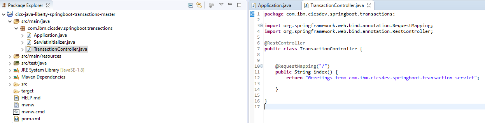
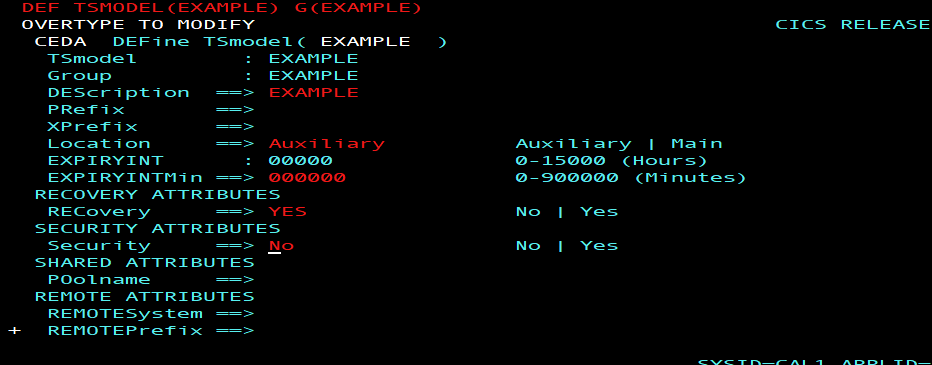

# Spring Boot Java applications for CICS - Part 3 - Transactions

## Introduction

This tutorial describes how to develop a transactional Spring Boot application for use in CICS Liberty. We'll cover Spring Boot's approach to container managed transactions using the `@Transactional` annotation, as well the Spring `TransactionTemplate` interface for a Bean Managed Transaction. These approaches are then contrasted with the Java EE approach of using the JTA UserTransaction interface to create a bean managed transaction.

Transaction management in Liberty can be used to coordinate updates across multiple XA resource managers. In our scenarios, the Liberty transaction manager is the coordinator and the CICS unit of work is subordinate to this (as though the transaction had originated outside of the CICS system). CICS recoverable resources include temporary storge queues (TSQs), VSAM files, and JDBC type 2 connections to Db2, while recoverable resources used by Liberty but not managed by CICS include JDBC type 4 connections and JMS connection factories.


### Learning objectives

In this tutorial we will use a recoverable TSQ to demonstrate the principles of transaction coordination, we'll learn different ways of transactionally managing Spring Boot applications in a CICS Liberty JVM server, and we'll show how to build the application through Gradle or Maven giving access to the various transaction APIs.


The following steps give an overview of the objectives:

1. Create a basic Spring Boot web application.

2. Build and deploy the Spring Boot application with Gradle or Maven.

3. Create a CICS TSMODEL resource to designate a TSQ as recoverable. A recoverable TSQ is a simple construct to demonstrate the effects of transaction commit and rollback.

4. Use Spring Boot's `@Transactonal` annotation at the class or method level. This approach automatically integrates Spring Boot's transactional capability with the Liberty transaction manager and is similar in concept to EJB's Container Managed Transactions (CMT).

5. Use Spring's `TransactionTemplate` interface, this also gives automatic integration with the Liberty transaction manager, but is more similar to EJBs Bean Managed Transactions (BMT).

6. Use the Java EE approach with the `UserTransaction` interface to directly control the Liberty transaction manager. This is also a Bean Managed Transaction (BMT) approach.

All the techniques discussed integrate Spring Boot with Liberty's transaction manager. If you are running in CICS Liberty then the CICS unit-of-work (UOW) is also automatically integrated with the Liberty transaction, and becomes subordinate to Liberty's global (XA) transaction. The net result is that your Java work and CICS work can be committed or rolled back as one recoverable transaction. 
>**Note:** If using any of these JTA based transactional scenarios in CICS you cannot use the JCICS methods `Task.commit()` or `Task.rollback()` which drive a corresponding `EXEC CICS SYNPOINT` or `ROLLBACK`. This is because the CICS recovery manager for the task is subordinate to Liberty's transaction manager and all transactiona coordinatio must be done using JTA. 

The application source and build scripts are available in the associated Git [repository](https://github.com/cicsdev/cics-java-liberty-springboot-transactions/).


### Prerequisites

* CICS TS V5.3 or later
* A configured Liberty JVM server in CICS
* Java SE 1.8 on the z/OS system
* Java SE 1.8 on the workstation
* An Eclipse development environment on the workstation
* Either Gradle or Apache Maven on the workstation (Buildship or M2Eclipse)


### Estimated time

It should take you about 1 hour to complete this tutorial.


## Step 1: Create the Application


You can develop the code by following this tutorial step-by-step, or by downloading or cloning the [cics-java-liberty-springboot-transactions](https://github.com/cicsdev/cics-java-liberty-springboot-transactions) example in GitHub.

If you are following step-by-step, generate and download a Spring Boot web application using the Spring initializr website tool. For further details on how to do this, and how to deploy bundles to CICS, see this tutorial - [spring-boot-java-applications-for-cics-part-1-jcics-maven-gradle](https://developer.ibm.com/technologies/java/tutorials/spring-boot-java-applications-for-cics-part-1-jcics-maven-gradle). We use Eclipse as our preferred IDE.

Once your newly generated project has been imported into your IDE, you should have the `Application.java` and `ServletInitializer.java` classes which provide the basic framework of a Spring Boot web application. 



Next add the `TransactionController.java` class as shown below. This class is used as the central coordinator for all the REST requests from your browser. Later we will adapt and extend it to drive the different transactional approaches, but for now it's just a simple text response to the root REST request.

```java

package com.ibm.cicsdev.springboot.transactions;

@RestController
public class TransactionController 
{   
    @GetMapping("/")
    public String index() 
    {
        return "Greetings from com.ibm.cicsdev.springboot.transaction servlet";       
    }
}
```

If you are following step-by-step you can now run this locally as a Java Application, point your browser to `http://localhost:8080/` to test the basic function.

## Step 2: Building and deploying a Spring Boot web application with Gradle or Maven

In the first part of this tutorial series we looked in-depth at how to use Gradle or Maven to build a Spring Boot web application. [Spring Boot Java applications for CICS, Part 1: JCICS, Gradle, and Maven](https://developer.ibm.com/tutorials/spring-boot-java-applications-for-cics-part-1-jcics-maven-gradle/)

Using that knowledge you should now be in a position to enhance the *build.gradle*, or *pom.xml* to include the necessary dependencies to compile against a variety of Transaction APIs. In particular we require the libraries that provide the **Java Transaction API (JTA)** and **Spring's Transactional API**.

For Gradle, your build file should have the following dependencies.

```Gradle
dependencies
{    
    // CICS BOM (as of May 2020)
    compileOnly enforcedPlatform('com.ibm.cics:com.ibm.cics.ts.bom:5.5-20200519131930-PH25409')
    
    // Don't include JCICS in the final build (no need for version because we have BOM)
    compileOnly("com.ibm.cics:com.ibm.cics.server")   
    
    // Spring Boot web support
    implementation ("org.springframework.boot:spring-boot-starter-web")
    
    // Don't include TomCat in the runtime build
    providedRuntime("org.springframework.boot:spring-boot-starter-tomcat")
    
    // Java Transaction API (this is newer and covers up to jta-1.3)
    implementation ("javax.transaction:javax.transaction-api")
    
    // Spring's Transactional API
    implementation ("org.springframework:spring-tx")           
}
```

For Maven, you'll need the following dependencies in your pom.xml

```XML

  <!-- CICS TS V5.5 BOM (as of May 2020) -->
  <dependencyManagement>
    <dependencies>
      <dependency>
        <groupId>com.ibm.cics</groupId>
        <artifactId>com.ibm.cics.ts.bom</artifactId>
        <version>5.5-20200519131930-PH25409</version>
        <type>pom</type>
        <scope>import</scope>
      </dependency>
    </dependencies>
  </dependencyManagement>

  <dependencies>       
    <!-- Compile against, but don't include JCICS in the final build (version and scope are from BOM) -->
    <dependency>
      <groupId>com.ibm.cics</groupId>
      <artifactId>com.ibm.cics.server</artifactId>
    </dependency>
   
    <!-- Spring Boot web support -->   
    <dependency>
      <groupId>org.springframework.boot</groupId>
      <artifactId>spring-boot-starter-web</artifactId>
    </dependency> 
   
    <!-- Compile against, but don't include Tomcat in the runtime build --> 
    <dependency>
	  <groupId>org.springframework.boot</groupId>
	  <artifactId>spring-boot-starter-tomcat</artifactId>
	  <scope>provided</scope>
    </dependency>
	  
    <!-- Spring's Transactional API -->
    <dependency>
      <groupId>org.springframework</groupId>
      <artifactId>spring-tx</artifactId>
    </dependency> 
				
    <!-- Java Transaction API -->
    <dependency>
      <groupId>javax.transaction</groupId>
      <artifactId>javax.transaction-api</artifactId>
    </dependency>	  
	  
  </dependencies>  
```

Running the build tool of your choice should produce a WAR file ready to deploy. When the time comes (see later), you can deploy it in a CICS bundle, or directly as an `<application>` element in the Liberty server.xml. For further details on configuring a Liberty JVM server and deploying the sample to CICS can be found in the Git repository [README](https://github.com/cicsdev/cics-java-liberty-springboot-transaction/README).


## Step 3: Create a TSMODEL

Our next step is to interact with a CICS recoverable resource. We chose a recoverable TSQ for simplicity, the contents of the TSQ can provide a clear indication of the commit/rollback effects.

For transactional recovery to work with TSQs you need to make the TSQ recoverable. To do this define a CICS TSMODEL resource with the *Prefix* attribute set to the name of the TSQ, and a *Recovery* attribute set to Yes. Our TSQ is called "EXAMPLE", don't install the TSMODEL yet - you'll get a better indicator of the transactional intent if we save that for later. 


For example:




## Step 4 : Spring Boot @Transactional

So let's update our code to demonstrate Spring Boot's approach to container managed transactions. The `@Transactional` annotation can be used at the class or method level. 
The advantage of the `@Transactional` annotation over Bean Managed Transactions is that you do not explicitly have to code `begin()` and `commit()` to demark the transaction. Instead you call a class or method that has the `@Transactional` annotation on it. Spring Boot, by virtue of integration with Liberty's transaction manager, then co-ordinates the transaction with both Liberty and the CICS UOW.

So let us create our new class `SpringTransactional.java` to demonstrate Spring Container Managed Transactions.

```java
package com.ibm.cicsdev.springboot.transactions;
    
import org.springframework.stereotype.Component;
import org.springframework.transaction.annotation.Transactional;
import com.ibm.cics.server.CicsConditionException;
import com.ibm.cics.server.TSQ;
    
/**
 * This component uses @Transactional to manage transactions in
 * a container oriented manner.
 */
@Component
public class SpringTransactional 
{
    /**
     * Write an input string to a CICS TSQ using the @Transactional annotation. 
     * If the input text contains 'rollback' then generate a RuntimeException
     * which triggers rollback.
     * 
     * @param text
     * @return status message
     * @throws CicsConditionException 
     */
    @Transactional (rollbackFor=Exception.class)
    public String writeTSQ(String text) throws CicsConditionException 
    {
        // Create JCICS representation of TSQ object
        TSQ tsq = new TSQ();
        tsq.setName(Application.TSQNAME);
    
        // Write it to the TSQ
        tsq.writeString(text);
    
        // If the string contains 'rollback' then throw an exception to trigger rollback
        if (text.contains("rollback")) 
        {
            throw new RuntimeException("SpringTransactional.writeTSQ(): Rollback request was detected"); 
        }	
    
        return text;
    }
}
```

In this example we write text to the CICS TSQ using the `TSQ` method `writeString()` and then either commit or rollback the transaction. If the text contains the word 'rollback' we throw an Unchecked `RuntimeException` to force rollback, otherwise the transaction is committed.

> **Note:** By default the Spring framework transaction infrastructure only marks a transaction for rollback if it detects an unchecked exception. JCICS exceptions, such as a `CICSConditionException` are checked. In order to rollback for all exceptions (including the CICS checked exceptions) we can override the default behaviour with an explicit setting on the annotation as shown: `@Transactional(rollbackFor=Exception.class)`.


To use our `SpringTransactional` class we need to update our `TransactionController.java` with a new method to *autowire* in an instance of the `SpringTransactional` class and then to drive it in response to a web request. Add the following code into your `TransactionController.java` class which will map requests to the `/transactionalCommit` URL to the `SpringTransactional` method `writeTSQ()`.

```java
    @Autowired SpringTransactional transactional;
	
    /**
     * Demonstrate Transactional annotation commit
     * @return status message
     */
    @GetMapping({"/transactionalCommit", "/transactionalcommit"})
    public String transactionalCommit() 
    {
        // Commit a TSQ write using Spring's @Transactional annotation
        try 
        {
            return this.transactional.writeTSQ("hello CICS from transactionalCommit()");
        }
        catch(Exception e)
        {                           
            e.printStackTrace();
            return "transactionalCommit: exception: "  + e.getMessage() + ". Check dfhjvmerr for further details.";
        }       
    }
```

You can now deploy the application to CICS and run the request using the *root URL* with the new URL mapping `transactionalCommit`. You should see the web browser return "hello CICS from transactionalCommit()". 
Browsing the  TSQ called EXAMPLE using the CICS transaction `CEBR` will show the same string written to the TSQ as shown below.

```
  CEBR  TSQ EXAMPLE          SYSID Z32A REC     1 OF     1    COL     1 OF    38
  ENTER COMMAND ===>                                                            
       **************************  TOP OF QUEUE  *******************************
 00001 hello CICS from transactionalCommit()                                 
       *************************  BOTTOM OF QUEUE  *****************************
                                                                                
                                                                                
                                                                                
                                                                                
                                                                                
 PF1 : HELP                PF2 : SWITCH HEX/CHAR     PF3 : TERMINATE BROWSE     
 PF4 : VIEW TOP            PF5 : VIEW BOTTOM         PF6 : REPEAT LAST FIND     
 PF7 : SCROLL BACK HALF    PF8 : SCROLL FORWARD HALF PF9 : UNDEFINED            
 PF10: SCROLL BACK FULL    PF11: SCROLL FORWARD FULL PF12: UNDEFINED            
 ```


Now let's add a second end-point which calls the same `SpringTransactional` class, but this time with the text "rollback" in the message. Add the following code into `TransactionController.java`.

```java
    /**
     * Demonstrate Transactional annotation rollback
     * @return status message
     */
    @GetMapping({"/transactionalRollback", "/transactionalrollback"})
    public String transactionalRollback()
    {
        // Attempt to write to a TSQ
        // ...but when the string 'rollback' is detected in the input we 
        // intentionally throw a runtime exception which the @Transactional 
        // annotation has been qualified to detect and trigger a rollback.
        try 
        {
            return this.transactional.writeTSQ("rollback from transactionalRollback()");
        }
        catch(Exception e)
        {
            e.printStackTrace();
            return "transactionalRollback: exception: "  + e.getMessage() + ". Rollback triggered - see dfhjvmerr for further details.";
        }       
    }
```

This time if you use your browser to request the `/transactionalRollback` end-point you will be informed that an Exception occurred and that rollback was driven. If you browse the TSQ again, and see a second entry  this is because we haven't yet installed the TSMODEL definition into CICS in order to designate the TSQ as recoverable. If you hold off installing the TSMODEL, you can run the rest of this tutorial proving that code is executed and that TSQ entries are written, then install the TSMODEL, purge the TSQ, re-run the examples and observe the differences when rollback takes effect.


## Step 5 : Spring's TransactionTemplate for Bean Managed Transactions

We will now create a class to use Spring's `TransactionTemplate` interface for a Bean Managed Transaction. This will use Spring Boot's programmatic approach to managing transactions. The following snippet shows Spring's `PlatformTransactionManager` and `TransactionTemplate` classes being set-up and called ready to take the contents of our transactional code.


```java

    private PlatformTransactionManager transactionManager;	
    private TransactionTemplate tranTemplate;	
    ...
    tranTemplate = new TransactionTemplate(transactionManager);
    tranTemplate.setPropagationBehavior(TransactionTemplate.PROPAGATION_REQUIRED);
    tranTemplate.execute(new TransactionCallbackWithoutResult() 
        {
            @Override
            protected void doInTransactionWithoutResult(TransactionStatus status) 
            {   
                if(<some condition here>)
                {            
                    status.setRollbackOnly();
                }
                
                // otherwise commit
            }           
        ...
```

This allows us to programatically rollback the transaction by calling the method `status.setRollbackOnly();`

Let's create our new class `SpringTransactionTemplate.java` which includes the code snippets above. As we did for the previous SpringTransactional approach, if the keyword "rollback" is detected in the text of the string, after writing to the TSQ, we will issue a rollback.

Add the following new class `SpringTransactionTemplate.java` to your project which will provide two new endpoints `/STcommit` and `/STrollback`.

```java
package com.ibm.cicsdev.springboot.transactions;
    
import org.springframework.beans.factory.annotation.Autowired;
import org.springframework.stereotype.Component;
import org.springframework.transaction.PlatformTransactionManager;
import org.springframework.transaction.TransactionDefinition;
import org.springframework.transaction.TransactionStatus;
import org.springframework.transaction.support.TransactionCallbackWithoutResult;
import org.springframework.transaction.support.TransactionTemplate;

import com.ibm.cics.server.CicsConditionException;
import com.ibm.cics.server.TSQ;


/**
 * This component demonstrates use of the Spring PlatformTransactionManager 
 * and TransactionTemplate to manage transactions in a Bean orientated 
 * manner.
 */
@Component
public class SpringTransactionTemplate 
{   
    @Autowired
    private PlatformTransactionManager transactionManager;


    /**
     * @param text
     * @return status message
     */
    public String writeTSQ(String text) 
    {   
        // Create transaction template
        TransactionTemplate tranTemplate = new TransactionTemplate(this.transactionManager);
        tranTemplate.setPropagationBehavior(TransactionDefinition.PROPAGATION_REQUIRED);
    
        // Execute the method to do the CICS update
        tranTemplate.execute(new TransactionCallbackWithoutResult() 
        {       
            @Override
            protected void doInTransactionWithoutResult(TransactionStatus status) 
            {               
                if (status.isNewTransaction()) 
                {
                    System.out.println("SpringTransactionTemplate.writeTSQ(): Starting new transaction");                   
                }           
                        
                // Force a rollback if the input matches a specific string 
                if (text.contains("rollback")) 
                {
                    status.setRollbackOnly();                   
                }
            
                // Create JCICS TSQ object
                TSQ tsq = new TSQ();
                tsq.setName(Application.TSQNAME);
            
                // Write the string to the TSQ 
                try 
                {                   
                    tsq.writeString(text);                                  
                } 
                catch (CicsConditionException e) 
                {               
                    // If JCICS command fails 
                    // then force a rollback of the transaction (which rolls back the CICS UOW)
                    System.out.println("SpringTransactionTemplate.writeTSQ(): " + e.getMessage() +  ". Unexpected exception,    rollback");
                    status.setRollbackOnly();
                    e.printStackTrace();
                }                                   
            }
        });
    
        return text;
    }        
}
```

To use this bean, we need to add some more code to our `TransactionController` to autowire in the `SpringTransactionTemplate` and to call our bean. Two methods are added, one will force a rollback, and the other a commit. Add the following code into `TransactionController.java`

```java
    @Autowired SpringTransactionTemplate springTemplateTran;
	
    /**
     * Spring Template managed transaction commit web request
     * @return message
     */
    @GetMapping({"/STcommit", "/stcommit"})
    public String springTemplateCommit() 
    {
        return this.springTemplateTran.writeTSQ("hello CICS from springTemplateCommit()");
    }

    
    /**
     * Spring Template managed transaction rollback web request
     * @return message
     */
    @GetMapping({"/STrollback", "/strollback"})
    public String springTemplateRollback() 
    {
        return this.springTemplateTran.writeTSQ("rollback from springTemplateRollback()");
    }
```

Go ahead and use Gradle or Maven to rebuild you project now. If you are deploying through a CICS bundle project, update the generated CICS bundle project in zFS and then disable and re-enable the CICS bundle. If you chose to deploy with an `<application>` element and have `<applicationMonitoring>` active, when you upload a new version of the WAR, Liberty will stop the application and restart it at the new version, otherwise you can restart the server to pick-up changes.

To drive our two new methods, use a browser as before, but this time request the new `/STcommit` and `/STrollback` end-points. You will be greeted by each request, and the TSQ called 'EXAMPLE' will be updated.

```
  CEBR  TSQ EXAMPLE          SYSID Z32A REC     1 OF     4    COL     1 OF    38
  ENTER COMMAND ===>                                                            
       **************************  TOP OF QUEUE  *******************************
 00001 hello CICS from transactionalCommit()                                    
 00002 rollback from transactionalRollback()                                    
 00003 hello CICS from springTemplateCommit()                                   
 00004 rollback from springTemplateRollback()                                    
       *************************  BOTTOM OF QUEUE  *****************************                                                                    
                                                                                
                                                                                
                                                                                
                                                                                
 PF1 : HELP                PF2 : SWITCH HEX/CHAR     PF3 : TERMINATE BROWSE     
 PF4 : VIEW TOP            PF5 : VIEW BOTTOM         PF6 : REPEAT LAST FIND     
 PF7 : SCROLL BACK HALF    PF8 : SCROLL FORWARD HALF PF9 : UNDEFINED            
 PF10: SCROLL BACK FULL    PF11: SCROLL FORWARD FULL PF12: UNDEFINED            
 ```


## Step 6 : Java EE UserTransaction approach to Bean Managed Transactions


In this final part of the tutorial we demonstrate how to use Liberty's Transaction manager directly from a Spring Boot application. This can be achieved by looking up the Java EE `java:comp/UserTransaction` context through JNDI and creating a `UserTransaction` object to perform a Bean Managed Transactions.

### JTA in a CICS Liberty JVM server

In CICS, there is an implicit UOW for every task, so transaction management does not need to be explicitly started. For JTA however, a Container Managed Transaction (CMT) annotation is required on a class or method, or a UserTransaction must be coded with the `begin()` method. A JTA transaction completes at the end of the annotation scope for CMT, or for a `UserTransaction` if the application reaches a U`serTransaction.commit()` or `rollback()`. If no commit or rollback is coded, the Liberty web-container will complete the transaction when the web request terminates.

To see a UserTransaction in action, let's create a new class called `JEEUserTransaction.java` as shown below.

```java
package com.ibm.cicsdev.springboot.transactions;

import javax.naming.InitialContext;
import javax.naming.NamingException;
import javax.transaction.UserTransaction;
import org.springframework.stereotype.Component;
import com.ibm.cics.server.TSQ;

/**
 * This class demonstrates the use of JNDI to look up a Java EE User Transaction context.
 * It then uses the Java Transaction API (JTA) and Liberty's transaction manager to create 
 * and manage work within a global transaction - to which a CICS UOW is subordinate.
 */
@Component
public class JEEUserTransaction 
{   
    
    /** 
     * write to a TSQ from within a Java EE UserTransaction 
     * 
     * @param text 
     * @return status message
     */
    public String writeTSQ(String text) 
    {
        // Look up the Java EE transaction context from JNDI 
        UserTransaction tranContext = lookupContext();          

        // Write a message to the TSQ
        try 
        {
            // Create a JCICS TSQ object
            TSQ tsq = new TSQ();
            tsq.setName(Application.TSQNAME);

            // Start a user transaction, write a simple phrase
            // to the queue and then commit or rollback.
            tranContext.begin();
            
            tsq.writeString(text);          
            if(text.contains("rollback"))
            {
                tranContext.rollback();
                return "JEEUserTransaction.writeTSQ(): TSQ written then 'rollback' issued";
            }
            
            tranContext.commit();
            return "JEEUserTransaction.writeTSQ(): TSQ written then 'commit' issued";                   
        } 
        catch (Exception e) 
        {           
            e.printStackTrace();
            return "JEEUserTransaction.writeTSQ(): unexpected exception: "  + e.getMessage() + ". Check dfhjvmerr for further       details.";
        }
    }

    
    private UserTransaction lookupContext() 
    {       
        // Use JNDI to find the Java EE (Liberty) transaction manager
        InitialContext ctx;     
        UserTransaction tran = null;
        try 
        {
            ctx = new InitialContext();
            tran = (UserTransaction) ctx.lookup("java:comp/UserTransaction");    
        }
        catch (NamingException e) 
        {
            e.printStackTrace();
            System.out.println("JEEUserTransaction.lookupContext(): lookup failed: " + e.getMessage());
        }

        // return the UserTransaction context
        return tran;
    }
}
```

To use this new class we autowire it into our `TransactionController` and add two new methods to commit and rollback updates. Add the following code into the 'TransactionController.java'.

```java
	@Autowired JEEUserTransaction jeeTran;
	
	/**
     * JEE UserTransaction commit
     * @return message
     */
    @GetMapping({"/JEEcommit", "/jeecommit"})
    public String javaEECommit() 
    {
        return this.jeeTran.writeTSQ("hello CICS from javaEECommit()");             
    }
    
    
    /**
     * JEE UserTransaction rollback
     * @return message
     */
    @GetMapping({"/JEErollback", "/jeerollback"})
    public String javaEErollback() 
    {
        return this.jeeTran.writeTSQ("rollback from javaEERollback()");     
    }   
```

To complete the demo, let's update the application root to provide usage instructions rather than a simple greeting. Modify the index method in `TransactionController.java` as shown:

```java
    /**
     * Provide a root for Usage: information
     * @return usage message
     */
    @GetMapping("/")
    public String index() 
    {               
        return "<h1>Spring Boot Transaction REST sample</h1>"
                + "<h3>Usage:</h3>"
                + "<b>/transactionalCommit</b> - Demo Spring Transactional annotation commit <br>"
                + "<b>/transactionalRollback</b> - Demo Spring Transactional annotation rollback <br>"
                + "<b>/STcommit</b> - Demo Spring Template commit <br>"
                + "<b>/STrollback</b> - Demo Spring Template rollback <br>"             
                + "<b>/JEEcommit</b> - Demo Java EE User Transaction commit <br>"
                + "<b>/JEErollback</b> - Demo Java EE User Transaction rollback";
    }
```


Don't forget to rebuild and re-deploy the modified application. Then use the `/JEEcommit` and `/JEErollback` end-points to run the new methods. If you browse the TSQ EXAMPLE you should now see the following additional lines added to the queue.

```
  CEBR  TSQ EXAMPLE          SYSID Z32A REC     1 OF     4    COL     1 OF    38
  ENTER COMMAND ===>                                                            
       **************************  TOP OF QUEUE  *******************************
 00001 hello CICS from transactionalCommit()                                    
 00002 rollback from transactionalRollback()                                    
 00003 hello CICS from springTemplateCommit()                                   
 00004 rollback from springTemplateRollback()      
 00005 hello CICS from javaEECommit()              
 00006 rollback from javaEERollback()              
       *************************  BOTTOM OF QUEUE  *****************************                                                                    
                                                                                
                                                                                
                                                                                
                                                                                
 PF1 : HELP                PF2 : SWITCH HEX/CHAR     PF3 : TERMINATE BROWSE     
 PF4 : VIEW TOP            PF5 : VIEW BOTTOM         PF6 : REPEAT LAST FIND     
 PF7 : SCROLL BACK HALF    PF8 : SCROLL FORWARD HALF PF9 : UNDEFINED            
 PF10: SCROLL BACK FULL    PF11: SCROLL FORWARD FULL PF12: UNDEFINED            
 ```

## Running the sample


To see the full effects of transaction updates on a TSQ in CICS from a Spring Boot application, you can delete the EXAMPLE queue using the `PURGE` comman in the CEBR transction. Then install the recoverable TSMODEL, which will mark the TSQ recoverable, and then rull all 6 web-requests again. With a recoverable TSQ in effect the rollback related writes will not be preserved and you should see the following output in the TSQ.

```
  CEBR  TSQ EXAMPLE          SYSID Z32A REC     1 OF     4    COL     1 OF    38
  ENTER COMMAND ===>                                                            
       **************************  TOP OF QUEUE  *******************************
 00001 hello CICS from transactionalCommit()                                    
 00002 hello CICS from springTemplateCommit()                                   
 00003 hello CICS from javaEECommit()              
        *************************  BOTTOM OF QUEUE  *****************************                                                                    
                                                                                
                                                                                
                                                                                
                                                                                
 PF1 : HELP                PF2 : SWITCH HEX/CHAR     PF3 : TERMINATE BROWSE     
 PF4 : VIEW TOP            PF5 : VIEW BOTTOM         PF6 : REPEAT LAST FIND     
 PF7 : SCROLL BACK HALF    PF8 : SCROLL FORWARD HALF PF9 : UNDEFINED            
 PF10: SCROLL BACK FULL    PF11: SCROLL FORWARD FULL PF12: UNDEFINED     
 ```


## Summary

This tutorial has demonstrated how to develop a Spring Boot application for CICS using tranasctional management. We presented three alternatives ways to achieve transaction management in Spring Boot with CICS. 
These are 
1) Spring's `@Transactonal` annotation
2) Spring's `TransactionTemplate` for Bean Managed transactions
3) The Java EE `UserTransaction` interface to directly drive the Java Transaction API (JTA)

## Further reading

- Spring [Introduction to Spring Framework transaction management](https://docs.spring.io/spring/docs/4.2.x/spring-framework-reference/html/transaction.html)
- Spring's programmatic transaction management - [Programmatic transaction management](https://docs.spring.io/spring/docs/3.0.0.M3/reference/html/ch11s06.html)
- IBM Knowledge Center [Java Transaction API (JTA) in CICS Liberty](https://www.ibm.com/support/knowledgecenter/en/SSGMCP_5.6.0/applications/developing/java/dfhpj2_jta.html)
- CICSDev blog - [Using Java Transactions in CICS Liberty to coordinate JDBC updates](https://github.com/cicsdev/blog-cics-java-jta-jdbc/blob/master/blog.md)


TODO: REMOVE THESE links as not AD related??

IBM Knowledge Center [Deploying a CICS bundle](https://www.ibm.com/support/knowledgecenter/en/SSSQ3W_5.6.0/com.ibm.cics.core.help/topics/tasks/task_deploy_bundle_project.html)
IBM Knowledge Center [BUNDLE resources](https://www.ibm.com/support/knowledgecenter/en/SSGMCP_5.6.0/com.ibm.cics.ts.resourcedefinition.doc/resources/bundle/dfha4_overview.html)
CICS Explorer Download [IBM CICS Explorer download and how to add the IBM CICS SDK for Java EE and Liberty to your CICS Explorer from](https://www.ibm.com/support/pages/cics-explorer-downloads)
Redbooks [Liberty in IBM CICS: Deploying and Managing Java EE Applications - this IBM Redbooks publication walks through everything you need to know about deploying applications in Liberty in CICS](http://www.redbooks.ibm.com/abstracts/sg248418.html?Open)


